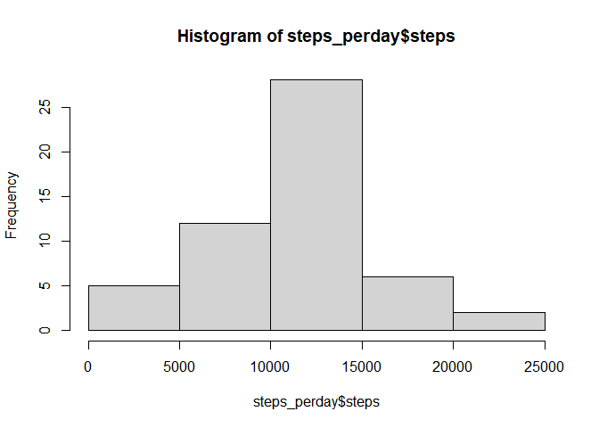
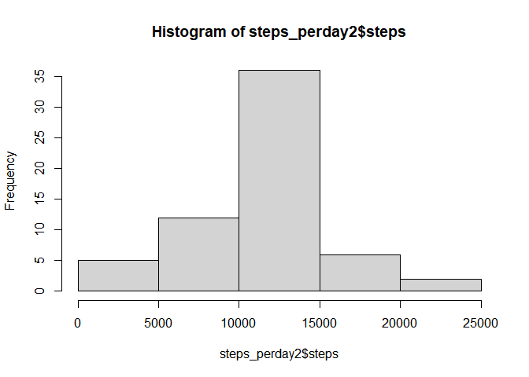
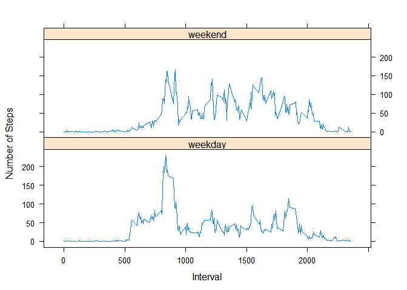

This document contains my work and answers to Coursera Reproducible Research Project 1. Data download and preperation is shown below. 


```r
data <- read.csv("activity.csv")
head(data)
```

```
##   steps       date interval
## 1    NA 2012-10-01        0
## 2    NA 2012-10-01        5
## 3    NA 2012-10-01       10
## 4    NA 2012-10-01       15
## 5    NA 2012-10-01       20
## 6    NA 2012-10-01       25
```

```r
str(data)
```

```
## 'data.frame':	17568 obs. of  3 variables:
##  $ steps   : int  NA NA NA NA NA NA NA NA NA NA ...
##  $ date    : chr  "2012-10-01" "2012-10-01" "2012-10-01" "2012-10-01" ...
##  $ interval: int  0 5 10 15 20 25 30 35 40 45 ...
```

```r
summary(data)
```

```
##      steps            date              interval     
##  Min.   :  0.00   Length:17568       Min.   :   0.0  
##  1st Qu.:  0.00   Class :character   1st Qu.: 588.8  
##  Median :  0.00   Mode  :character   Median :1177.5  
##  Mean   : 37.38                      Mean   :1177.5  
##  3rd Qu.: 12.00                      3rd Qu.:1766.2  
##  Max.   :806.00                      Max.   :2355.0  
##  NA's   :2304
```

## Question 1  
1. Calculate the total number of steps per day.

```r
steps_perday <- aggregate(steps~date, data, sum, na.rm=TRUE)
```
2. Make a historgram of total number of steps per day. 

```r
hist(steps_perday$steps)
```

<!-- -->
3. Report the mean and median of total number of steps per day

```r
summary(steps_perday$steps)
```

```
##    Min. 1st Qu.  Median    Mean 3rd Qu.    Max. 
##      41    8841   10765   10766   13294   21194
```

## Question 2  
1. Make a time series plot of the 5-minute intervals and the average number of steps taken, averaged across all days.

```r
steps_perinterval <- aggregate(steps~interval, data=data, mean, na.rm=TRUE)
plot(steps~interval, data=steps_perinterval, type = "l")
```

<!-- -->
2. Report the interval with the maximum number of steps taken per day.

```r
interval_maxsteps <- steps_perinterval[which.max(steps_perinterval$steps),]$interval
interval_maxsteps
```

```
## [1] 835
```

## Question 3  
1. Report the number of missing values.

```r
missing <- is.na(data)
sum(missing)
```

```
## [1] 2304
```
2. Create a new dataset without missing values. I used the means for each interval. 

```r
means_forNA <- function(interval){
  steps_perinterval[steps_perinterval$interval==interval,]$steps
}
data2 <- data
  for (i in 1:nrow(data2)) {
    if(is.na(data2[i,]$steps)){
      data2[i,]$steps <- means_forNA(data2[i,]$interval)
  }
}
```
3. Make a histogram of the total number of steps taken each day.

```r
steps_perday2 <- aggregate(steps~date, data=data2, sum)
hist(steps_perday2$steps)
```

<!-- -->
4. Report the mean and median of the new dataset for number of steps taken per day

```r
summary(steps_perday2$steps)
```

```
##    Min. 1st Qu.  Median    Mean 3rd Qu.    Max. 
##      41    9819   10766   10766   12811   21194
```

## Question 4  
1. Create a new factor variable to indicate if the day is a weekend of a weekday.

```r
data2$date <- as.Date(strptime(data2$date, format = "%Y-%m-%d"))
data2$day <- weekdays(data2$date)
  for (i in 1:nrow(data2)) {
    if(data2[i,]$day %in% c("Saturday", "Sunday")) {
      data2[i,]$day <- "weekend"
    }
    else{
      data2[i,]$day <- "weekday"
    }
  }
```
2. Create a panel plot showing the time series of 5-minute intervals and average number of steps taken, respectfully for both weekends and weekdays. 

```r
steps_byday <-aggregate(data2$steps~data2$interval+data2$day, data = data2, mean)
names(steps_byday) <- c("Interval", "Day", "Steps")
library(lattice)
xyplot(Steps~Interval|Day, steps_byday, type = "l", layout=c(1,2), xlab= "Interval", ylab = "Number of Steps")
```

<!-- -->
# This concludes this assignment. 
